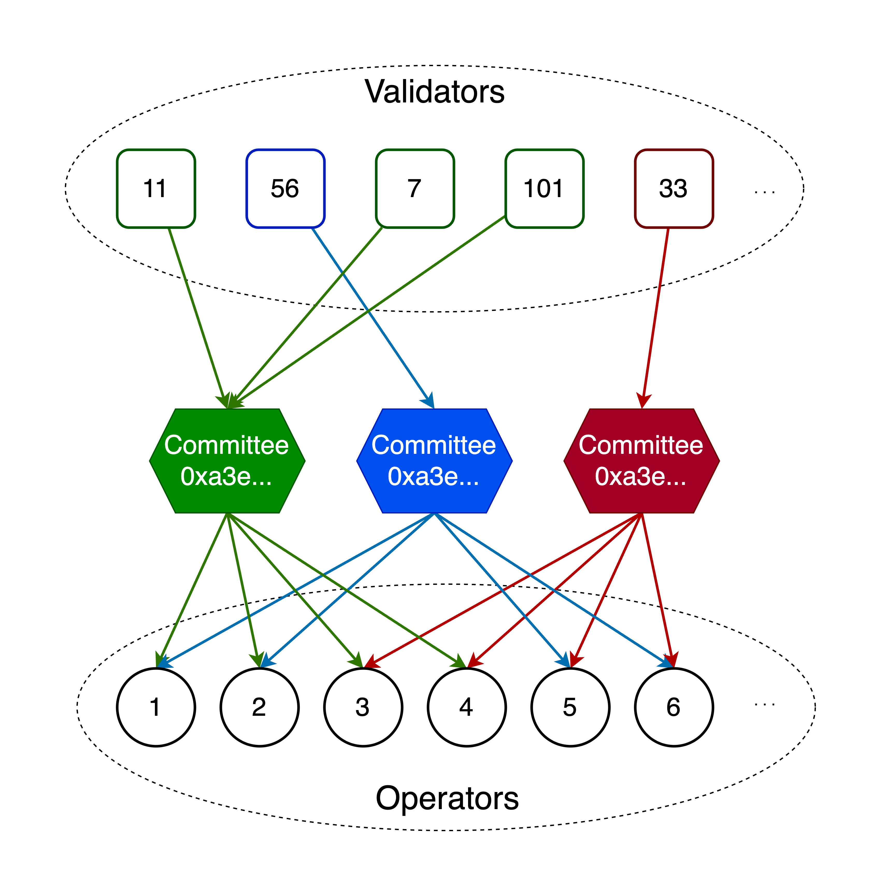

# SSV - Secret Shared Validator

## Introduction

Secret Shared Validator ('SSV') is a unique technology that enables the distributed control and operation of an Ethereum validator.

SSV uses an MPC threshold scheme with a consensus layer on top ([Istanbul BFT](https://arxiv.org/pdf/2002.03613.pdf)) to execute Ethereum duties in a secure way.

Its core strength is in its robustness and fault tolerance which leads the way for an open network of staking operators
to run validators in a decentralized and trustless way.

This repo contains the spec of the SSV protocol for the SSV.Network node.

## The Network

The SSV network is composed of several `operators`. Each operator is identified by a unique [`OperatorID`](./types/docs/README.md#operatorid-and-committeeid) and holds a netwok key for message authentication.

Every `validator` is registered to a unique committee of operators to execute its duties. When this happens, [`Share`](./types/docs/README.md#share--sharemember-and-committeemember--operator) objext are broadcasted publicly to the network.

A single `committee` of operators may run several validators at the same time.

The following image illustrates these relations.

<p align="center",float="left">

</p>

To execute the validators' duties, the operators exchange messages in the network. These messages are of type [`SignedSSVMessage`](./types/README.md#signedssvmessage-and-ssvmessage) which wraps either a consensus message ([`qbft.Message`](qbft/docs/README.md#message)) or a partial signature message ([`PartialSignatureMessages`](./types/README.md#partialsignaturemessages)).

To understand the protocol for executing duties, check out the [protocol explanation file](./ssv/README.md). The protocol is built upon the QBFT BFT consensus protocol. To understand our specification for the QBFT protocol, check the [QBFT module file](./qbft/README.md).

Also, for more details, check the documentation for the [`Operator`](./types/docs/README.md#share--sharemember-and-committeemember--operator), [`Validator`](./ssv/docs/README.md#validator), and [`Committee`](./ssv/docs/README.md#committee) structures.

## Spec tests

The [spec tests](ssv/spectest) are generated as a json file that can be run in any implementation. They test the various flows within the SSV package, treating the consensus protocol as as black box.
To generate all json spec tests, run:

```console
foo@bar:~$ make generate-jsons
```
Then run all tests with

```console
foo@bar:~$ make test
```
