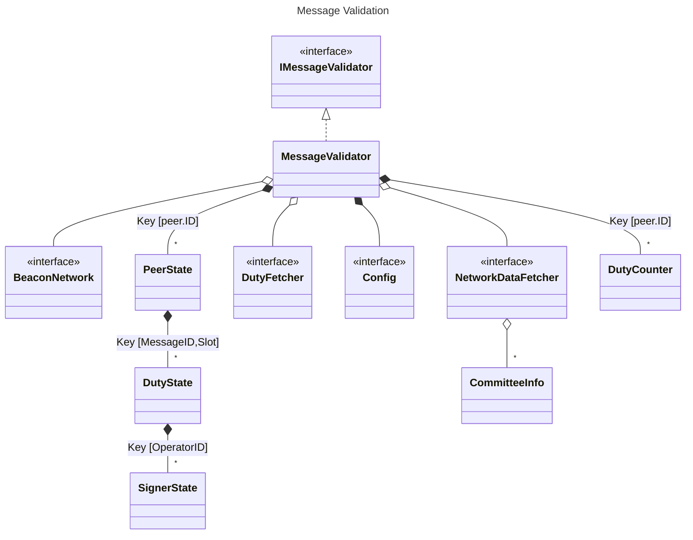

# Code Documentation



## IMessageValidator

`IMessageValidator` is an interface with a single method that has the following signature:
```go
ValidatorForTopic(topic string) func(ctx context.Context, peerID peer.ID, msg *pubsub.Message) pubsub.ValidationResult
```
This is the default function accepted by libp2p's GossipSub framework as an external validator. So, any implementation should follow this method.

## MessageValidator

`MessageValidator` is the main structure of this module. It implements the `IMessageValidator` interface.

Its `ValidatorForTopic` function calls a chain of validation for the pub-sub, syntax, semantics, QBFT and duty logic rules.

During the validation process, one of the errors listed in the `errors.go` file may be returned. If so, the result will be a `ValidationReject` if the error has the `reject` tag, else it will be a `ValidationIgnore`. If no error is returned, it outputs `ValidationAccept`.

For each peer, represented by the type `peer.ID`, it holds information such as how many duties the peer has sent messages for (`DutyCounter`) and its state regarding each duty (`PeerState`). This information is useful to validate upcoming messages from the peer mainly for QBFT and duty rules.

## PeerState

The `PeerState` structure represents a peer's view regarding each duty that it's aware of.

A duty is represented by a (MessageID, slot) tuple. The `types.MessageID` uniquely identifies the validator or committee (owner) and the duty type. Along with the slot number, the tuple completely identifies a single duty.

The state of the duty is stored in the form of a `DutyState` object.

### DutyState

The `DutyState` structure holds the state regarding a specific duty. This state is built according to messages received from the peer. Thus, it represents the peer's view on this duty.

To register the decided messages, it contains a set with lists of signers. To store this information in a set-like type (`map[T]struct{}`), we encode the signers list (`[]types.OperatorID`) into a `[sha256.Size]byte` type that can be hashed. With the set object, any duplicated decided message (i.e. two messages with the same signers but with different data) can be promptly checked.

Moreover, this structure also holds a `SignerState` for each operator that belongs to the duty.

### SignerState

The `SignerState` represents the state of a duty for a certain operator that belongs to the duty's committee, in the view of the peer.

It contains the current `Round` for the operator, a `ProposalData` updated upon a proposal message from such operator, and a `MessageCounts` object with counters to track each message type that is received.

### MessageCounts

The `MessageCounts` structure helps compose a `SignerState` by counting the number of messages, per message type, that a certain operator has sent (in the view of a peer). Thus, it has a counter for the following message types:
- Pre-Consensus
- Proposal
- Prepare
- Commit
- Round-Change
- Post-Consensus

Each counter can be validated against a limit. For all counters, this limit is set to 1.

The QBFT counters are specific to a certain round. So, once the operator changes to a new round, all of such counters are set to 0.

## DutyCounter

`DutyCounter` allows `MessageValidator` to count the number of duties per (validator/committee, epoch) tuple according to some peer's messages. Thus, this is a peer's view regarding existing duty assignments.

With this information, the `MessageValidator` can validate whether upcoming messages are possible considering the protocol's rules.

For each duty type and owner (uniquely identified by the `types.MessageID`), it stores the (epoch, slot) tuple in which a duty instance happened.

## NetworkDataFetcher

`NetworkDataFetcher` is an interface used by the `MessageValidator` to get information about the network. It includes the methods:
- `ValidDomain`: to check if a given domain matches the network's domain.
- `CorrectTopic`: to check if a message was sent in the correct topic.
- `GetCommitteeInfo`:  to get information about a certain committee, returning a `CommitteeInfo` object.
- `ExistingValidator`: to check if a validator exists.
- `ActiveValidator`: to check if a validator is active.
- `ValidatorLiquidated`: to check if a validator is liquidated.
- `ExistingCommitteeID`: to check if a committee exists.

### CommitteeInfo

The `CommitteeInfo` is an auxiliary structure that holds information about a committee, including its operators, list of validators, and its `CommitteeID`. The `MessageValidator` acquires objects of such type through the `NetworkDataFetcher`.

## Config

The `Config` interface provides protocol configurations for the `MessageValidator`. For now, it only includes a method to compute the leader for a certain height and round.

## DutyFetcher

`DutyFetcher` is an interface used by the `MessageValidator` to get information about Ethereum duty assignments. Namely, it can check whether a validator has a proposal, sync committee, or sync committee contribution duty.
