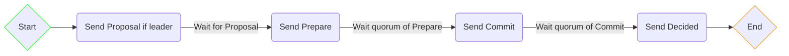
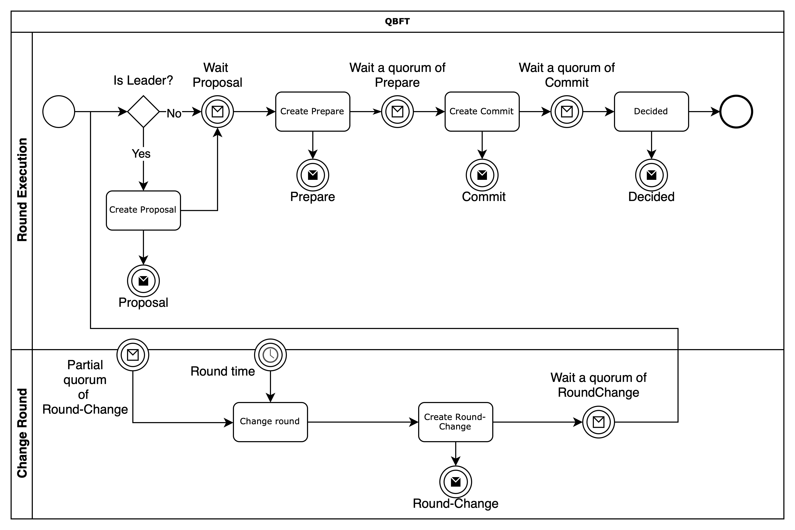

# QBFT

## Introduction
This is a spec implementation for the [QBFT](https://arxiv.org/pdf/2002.03613) protocol, following the [formal verification spec](https://entethalliance.github.io/client-spec/qbft_spec.html#dfn-qbftspecification) ([github repo](https://github.com/ConsenSys/qbft-formal-spec-and-verification)).

## Overview

A high level view of the steps of a QBFT round can be seen in the following state diagram (a more complete view can be seen below in a [BPMN diagram](#bpmn-diagram)).

Notice that there are some divergencies from the paper, namely:
- Proposal is an equivalent name for Pre-prepare.
- We have an extra message named Decided. This message is an aggregation of a quorum of Commit messages plus the proposal data. Its main reason of existence is that, if there is a late replica that didn't receive the quorum of Commits yet, as soon as it receives the Decided message it has all the necessary information that allows it to finish the consensus execution.

## Important note on message processing
The spec only deals with message process logic but it's also very important the way controller.ProcessMsg is called.
Message queueing and retry are important as there is no guarantee as to when a message is delivered.
Examples:
* A proposal message can be delivered after its respective prepare
* A next round message can be delivered before the timer hits timeout
* A late commit message can decide the instance even if it started the next round
* A message can fail to process because it's "too early" or "too late"

Because of the above, there is a need to order and queue messages based on their round and type so to not lose message and make the protocol round change.

## Module Documentation

Check the [module documentation](docs/README.md) to better understand the implementation components.

## Appendix

### BPMN diagram

Note:
- Messages filled in white represent received messages.
- Messages filled in black represent broadcasted messages.