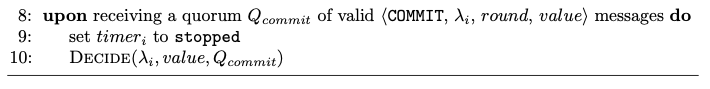

# Commit

*Moniz, H. The Istanbul BFT Consensus Algorithm. Algorithm 2. 2020*

## Validation

The paper doesn't include any extra validation for the commit rule. But, as it was with the *Prepare* message, the implementation's *Commit* uses a hash of the value. So, the same hash validation as in the [prepare rule](PREPARE.md) is performed.

## Body (UponCommit)

The differences in the rule's implementation are:
- Upon recieving a quorum of *Commit* messages, an aggregated BLS signature is created. This is used as return value to the object using the QBFT instance (QBFT controller) and serves as proof of termination.
- In the paper specification, the process can decide and terminate after receiving a quorum, $2f+1$, of *Commit* messages. In the implementation, even after the process has decided, it shall still process new *Commit* messages in order to aggregate their signatures in the threshold signature. That way, it can update information regarding the decided set of nodes.
- The timer is not set to stop.