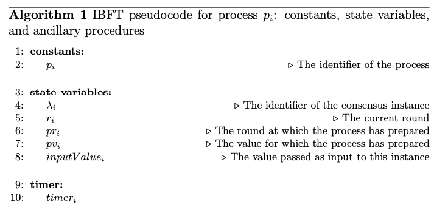
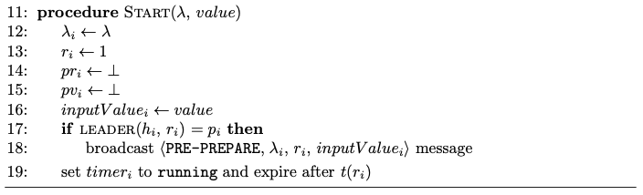

# Instance structure

The paper's algorithm illustrates the protocol rules for one instance of the IBFT, which is identified by $\lambda_1$. 

*Moniz, H. The Istanbul BFT Consensus Algorithm. Algorithm 1. 2020*

An instance of the QBFT is represented by the *Instance* structure. The state variables are stored as in the *State* attribute which contains a height and an ID as identifiers, along with the other necesary variables.

## Initialization

*Moniz, H. The Istanbul BFT Consensus Algorithm. Algorithm 1. 2020*

The *Instance* class has a *Start* function that does precisely the same as the paper pseudo-code.