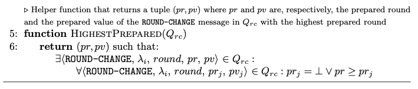
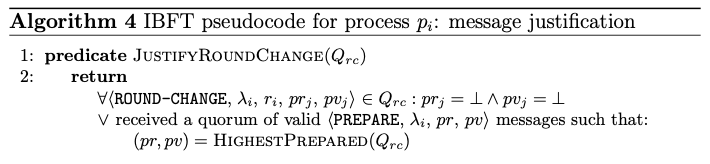
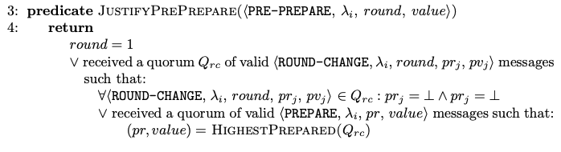

# Message Justification Functions

## HighestPrepared

*Moniz, H. The Istanbul BFT Consensus Algorithm. Algorithm 4. 2020*

In the implementation, the only difference is the return value. Instead of returning the tuple (*prepared_round*,*prepared_value*), the function returns the signed message that contains such tuple.

## JustifyRoundChange

*Moniz, H. The Istanbul BFT Consensus Algorithm. Algorithm 4. 2020*

The same logic is applied in the implementation. The only difference is that the process doesn't look for received *Prepare* messages. Instead, the [*Round-Change* message structure](ROUND_CHANGE.md#structure) carries a list of *Prepare* messages that justifies its *prepared_round* and *prepared_value* attributes.

## JustifyPrePrepare

*Moniz, H. The Istanbul BFT Consensus Algorithm. Algorithm 4. 2020*

The implementation follows the same logic as the paper's specification. However, there are two observations:
- firslty, the $\beta$ predicate verification is included in the function implementation. This is done since such verification is implicit in the validation of *Pre-Prepare* messages.
- secondly, the quorum of *Round-Change* and *Prepare* messages are obtained by the *Proposal* message itself. Look [here](PROPOSAL.md) to remember its structure. Therefore, the node doesn't have to look for any message that it has received.