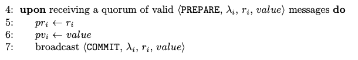

# Prepare

*Moniz, H. The Istanbul BFT Consensus Algorithm. Algorithm 2. 2020*

## Validation

The paper doesn't include any validation in the prepare rule. However, since the implementation's *prepare* message contains the hash of the *value*, we need to check if the hash is correct. This is done by comparing to the hash of the *ProposalAcceptedForCurrentRound* attribute updated in the *UponProposal* rule.

Since we verified the $\beta$ predicate for the proposal message, it's redundant to do it here.

## Body (UponPrepare)

The rule is implemented the same way as the paper proposes. The only changes are:
- the hash being sent in the commit message, instead of the whole data (as it's done with the prepare message).
- a verification that it has never sent a commit for that round (to avoid communication overload).

