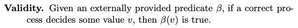
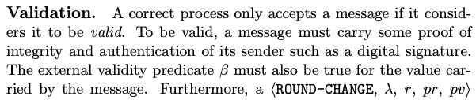

# Properties
The *Validity* property described in the paper is:

*Moniz, H. The Istanbul BFT Consensus Algorithm. Preliminaries. 2020*

<!--
> Given an externally provided predicate $\beta$, if a correct process decides some value $v$, then $\beta(v)$ is true.
-->
<!--
Usually, the *Validity* property may be defined in different ways. For example:
> If all correct processes propose the same value $v$, then any correct process that decides, decides $v$

> If a correct process decides $v$, then $v$ was proposed by some process.

or as the *Predicate-based validity* used in the paper.
-->

Nonetheless, the predicate isn't explicited in the pseudo-code algorithm. On "Validation", on the other hand, is said:

*Moniz, H. The Istanbul BFT Consensus Algorithm. Validation. 2020*
<!--
> A correct process only accepts a message if it considers it to be valid. To be valid, a message must carry some proof of integrity and authentication of its sender such as a digital signature. The external validity predicate $\beta$ must also be true for the value carried by the message.
-->

---

In the implementation, BLS digital signatures are verified for every message and the predicate is used only on pre-prepare (proposal) and round-change messages. For other messages, the value attribute is compared to a stored value and thus the predicate validation is implicit.

The $\beta$ predicate is contained in the *Config* attribute of *Instance*. It is passed on the object's creation and verifies if the value is in accordance to the underlying validator duty. For example, for a block proposal duty, it may verify if the block is well constructed and that no slashable offense is being made.