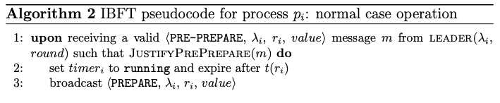

# Proposal / Pre-prepare

**Important note (!)**: The paper's *pre-preapre* message was renamed as *proposal* message.

*Moniz, H. The Istanbul BFT Consensus Algorithm. Algorithm 2. 2020*

## Validation

In the paper, upon a proposal message, three verifications should be performed:
- check if the leader was the sender of the message
- check *JustifyPrePrepare(message)*
- an extra implied $\beta$ predicate evaluation

In the implementation:
- **leader confirmation** is achieved by veryfing that the author of the BLS signature is the actual leader for the indicated round.
- the **$\beta$ predicate** is verified as discussed [here](PROPERTIES.md).
- ***JustifyPrePrepare*** is performed by the *isProposalJustification*.

## Body (UponProposal)

In the function's body, there are four differences to the paper specification.

1. The proposal message carries not only the (height, round, value) fields but also a list of Round-Change and a list of Prepare messages. Thus, in the *JustifyPrePrepare* function, instead of looking for quorum received, the proposal message already provides such quorum that justifies itself.
2. Besides the timer, the round attribute is also updated. The paper's algorithm performs this round update in the $f+1$ *round-change* rule. Here, such update is checked in both rules. This is useful in the following scenario:
    - a node $j$ was temporarily isolated from the network and never received any Round-Change or Prepare messages.
    - since it never received $f+1$ Round-Change messages, it also never updated its *Round* attribute.
    - node $j$ receives a correct Proposal message from node $i$.
    
    in such scenario, the proposal message would justify itself and the *Round* attribute of node $j$ would be updated.
3. Instead of broadcasting the prepare message with the value proposed, the hash of the value is used. This reduces communication complexity (number of bits exchanged).
4. At last, a variable *ProposalAcceptedForCurrentRound* is updated with the proposal value received. This allows the verification of incoming *Prepare* messages.