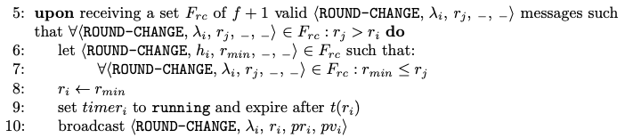
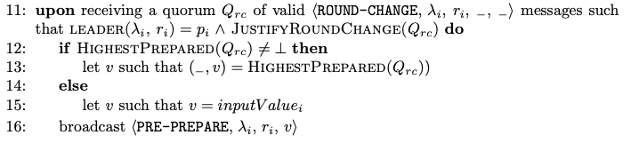

# Round change

*Moniz, H. The Istanbul BFT Consensus Algorithm. Algorithm 3. 2020*

*Moniz, H. The Istanbul BFT Consensus Algorithm. Algorithm 3. 2020*

## Structure

In the implementation, the *Round-Change* message has a different structure. Besides the paper fields, it also carries a list of *Prepare* messages that justifies the fields (*prepared_ round*,*prepared_value*). That way, even if the recipient has not received any *Prepare* messages, it can verify the correctness of the *Round-Change* message.

Therefore, when validating a *Round-Change* message, an extra step is performed in order to verify the authenticity of the *Prepare* messages appended.

## Round-Change $F+1$ rule

The only difference in the implementation is that the variable *ProposalAcceptedForCurrentRound* is set to *nil*, as it's done in the [timeout rule](TIMER_EXPIRATION.md).

## Round-Change Quorum rule

This rule's implementation does exactly what is specified in the paper.