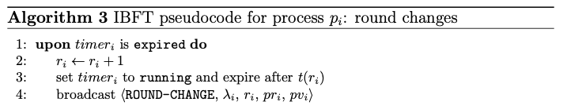

# Timer expiration

*Moniz, H. The Istanbul BFT Consensus Algorithm. Algorithm 3. 2020*

## Body (UponRoundTimeout)

The only difference in the implementation is that the variable *ProposalAcceptedForCurrentRound* is set to *nil* since the node progressed to a new round, which follows the [QBFT Dafny specification](https://github.com/ConsenSys/qbft-formal-spec-and-verification/blob/main/dafny/spec/L1/node.dfy#L442).