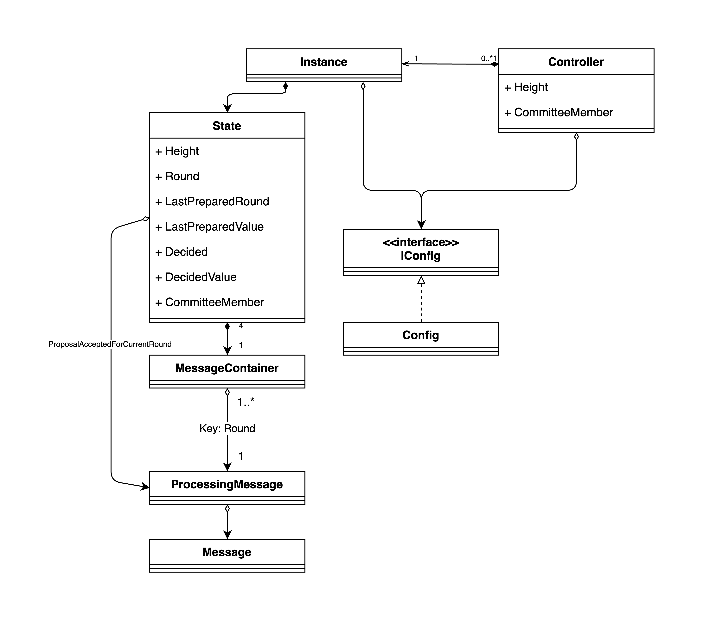

# Code Documentation

<p align="center",float="left">

</p>

## Message

`Message` represents a QBFT message.

```go
type Message struct {
	MsgType    MessageType
	Height     Height
	Round      Round
	Identifier []byte

	Root                     [32]byte
	DataRound                Round
	RoundChangeJustification [][]byte
	PrepareJustification     [][]byte
}
```

It contains:
- `MsgType`: that represents one of the possible types of messages (Proposal, Prepare, Commit, or Round-Change).
- `Height`: the height of the associated QBFT execution.
- `Round`: the message round.
- `Identifier`: the identifier related to the message, similar to the one hold by the [`Controller`](#controller).
- `Root`: the hash of the proposed data, if necessary.
- `DataRound`: the round related to the proposed data, for Round-Change messages.
- `RoundChangeJustification`: used for the Proposal and Round-Change messages. For the Proposal message, it contains a list of Round-Change messages. For the Round-Change message, it contains a list of Prepare messages.
- `PrepareJustification`: used for the Proposal message. Includes a list of Prepare messages.

Notice that there's no field for the sender (`OperatorID`), the signature or the proposed data (that must be included in the Proposal message and may be included in the Round-Change message). All of this fields are included in the upper wrapper (`types.SignedSSVMessage`). This is useful to detach the whole proposed data from the signature. Notice, however, that the signature is still binded to the proposed data by the field `Root` which is the hash of the data.

## ProcessingMessage

`ProcessingMessage` is an auxiliary structure that holds both a `Message` as well as its upper wrapper `types.SignedSSVMessage`. This is useful because the signature can be verified, using the `types.SignedSSVMessage` field, and the message's content can be easily accessed through the `Message` field without having to do several decoding operations.

## MsgContainer

`MsgContainer` is a structure that holds [`ProcessingMessages`](#processingmessage). It organizes the messages by its round through a map indexed with the `Round` type.

## IConfig

`IConfig` is an interface that allows the configuration of a QBFT execution. For example, it has methods to provide:
- The leader replica for a certain round (`ProposerF` function)
- A value check function (similar to the *external predicate* mentioned in the [QBFT paper](https://arxiv.org/pdf/2002.03613)).
- The time duration for a certain round.
- The cut-off round (after which the instance should be stopped).

As default implementation, we have the `Config` structure.

## State

`State` is a structure that represents the state of a QBFT instance. It includes:
- `CommitteeMember`: that contains information about the set of replicas (committee of operators), including their `OperatorIDs` and network public keys.
- `ID`: an identifier similar to the one hold by the [`Controller`](#controller).
- `Round`: the current round.
- `Height`: the height of instance (that identifies the instance). In practice, this `Height` is the slot number of the duty.
- `LastPreparedRound` and `LastPreparedValue`: the state regarding the last round in which the operator has prepared.
- `ProposalAcceptedForCurrentRound`: the current round's proposal message, helpful to validate upcoming messages and store the proposed data.
- `Decided` and `DecidedValue`: stores whether or not the instance has decided and, if so, for which value.
- Four `MsgContainer` objects, one for each message type.

## Instance

`Instance` is an structure that represents a single QBFT execution. It holds a [`State`](#state), a [`IConfig`](#iconfig), and its start value (to be proposed if possible in case it's the leader).

It has methods to start the the QBFT protocol and to process a message. Once processing a message, it also performs a message validation as described in the formal specification.

The message processing function, which is called by the [`Controller`](#controller), returns the current state of whether it's decided or not (and the decided value) along with an aggregated commit message that will serve as the decided message.

## Controller

The main entry point of this module is the `Controller` structure. Its main goal is to allow the operator to manage sequential executions of the QBFT protocol (QBFT instances).

The controller includes:
- `Identifier`: to uniquely identify the QBFT controller. In this module, it's abstracted as a sequence of bytes but, in practice, it's a `types.MessageID` object that uniquely identifies a validator (or a committee for committee duties) and a duty type. This identifier is replicated into the [`Instance`](#instance)'s [`State`](#state) and into the QBFT messages.
- `Height`: the current execution's height. Note that the QBFT executions are sequential so no execution run in parallel.
- `StoredInstances`: a container to save the history of QBFT instances.
- `CommitteeMember`: that contains information about the operator itself, such as its `OperatorID` and network public key, and about the whole committee of operators, including their `OperatorID`s, network public keys and the number of faulty nodes for such committee.
- `config`: the [QBFT configuration](#iconfig) which is passed to its [`Instances`](#instance).


The controller provides methods to start a new QBFT instance, provided of a given height and start value, and to process messages.

If the received message is a Decided message, it simply updated the instance state's Commit container, if the instance exists. When processing a non-decided message, if the instance returns, for the first time, that it has decided, the controller broadcasts a Decided message (which is a quorum aggregation of Commit messages).

For a non-decided message, if the associated instance has already decided, the controller doesn't process the message since it's irrelevant for its state.