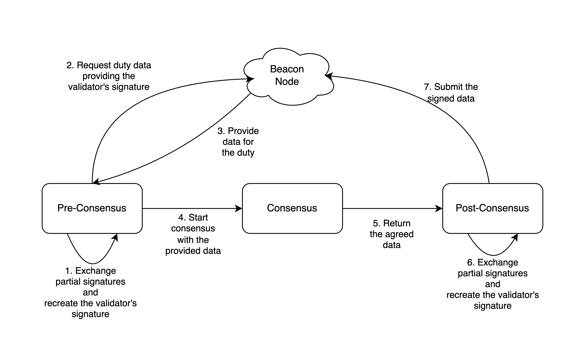

# SSV Protocol

This module presents the SSV protocol for executing the duties in a decentralized way.

## System Model

Our **system model** is composed of a set of replicas $N$ (a committee of operators), out of which at most $f = \lfloor \frac{N-1}{3} \rfloor$ may be faulty. I.e., we are dealing with the optimal resiliency for the **Byzantine Fault Tolerance (BFT)** model.

This **committee** is assigned to a set of **validators**, from whom the duties must be executed. For each validator, the private key is shared in a way that each operator holds a **private share key** and its associated public key. Moreover, each operator holds a **network private and public key** for authentication in the network communication.

We use the abstraction that:
- there's a **P2P network** through which the node (operator) may broadcast and receive messages.
- there's a connection to a **Beacon node** that provides duties' related data (e.g. an attestation vote) and allows the node to submit signed data to the blockchain.
- there's a connection to the **Beacon network** that provides information about the blockchain (e.g. the current slot and fork version).

## Duty Execution

In a high level view, to respond to a duty, a committee of operators must decide on a common data and construct the validator's signature over such data.

At first, it seems that two steps are needed: a BFT consensus protocol (for deciding on the common data) and a partial signature exchange phase (to construct the validator's signature). However, for some duty types, to first obtain the data to be proposed in the consensus protocol, the validator signature over some data is required (e.g. the validator's RANDAO signature that forms up the block). Thus, in general, there are three steps:
- **Pre-Consensus**: for constructing the validator's signature over some data in order to request a duty's related data from the Beacon node.
- **Consensus**: for deciding on a common data to be signed.
- **Post-Consensus**: for constructing the validator's signature over the decided data, in order to submit the signed data to the Beacon node.

This steps can be better visualized in the following diagram.

The Ethereum duties that require a the Pre-Consenus phase are the Proposer, Aggregation and Sync Committee Contribution duties. The other duties (Attestation and Sync Committee) start from step 2 of the above diagram (without needing to provide any signature). In the Pre-Consensus phase:
- the Proposer duty should construct the validator's signature over the `Epoch` number to build the `RANDAO` object.
- the Aggregator duty should construct the validator's signature over the `Slot` number to submit an `AggregateSelectionProof`.
- the Sync Committee Contributor duty should, for each committee index, construct the validator's signature over the `SyncAggregatorSelectionData` object to check if it's an aggregator.

To reconstruct the validators signature, at minimum a *threshold* amount of signatures is needed. In our case, this *threshold* is $\lfloor \frac{N+f}{2} \rfloor + 1$ (or $2f+1$ in case $N = 3f+1$).

### Duty start time

Within the duty's slot, thhe time at which the operators should start the duty depends on the duty type.

- For the Proposer duty, the protocol should be executed as soon as the slot starts (so no delay).
- For the Attestation and Sync Committee duties, the protocol should be executed after one third (1/3) of the slot duration, i.e. 4 seconds. This helps maximizing the chance of voting for the most recent proposed block.
- For the Aggregation and Sync Committee Contribution duties, the protocol should be executed after two thirds (2/3) of the slot duration, i.e. 8 seconds. This helps maximizing the collection of Attestation and Sync Committee votes.

## Validator Registration and Voluntary Exit Duties

Apart from the known Ethereum duties, there are two extra duties that may be performed for a validator:
- `ValidatorRegistration`: to perform the registration of the validator to the blockchain.
- `VoluntaryExit`: to exit the validator from the blockchain.

Both duties are only composed by the Pre-Consensus phase since only a signature construction is needed over an a prior known data.

Regarding the duties' start time, both should start at the beginning of the slot.

## The Committee duty
Since the committee may manage several validators, many Attestation duties may need to be performed in the same slot. This represents a workload concern. Luckly, we have that all consensus executions for each attestation duty agree on the same data (the Casper FFG and LMD GHOST votes). Therefore, we can perform a single consensus execution for all validators assigned in the same slot (though a unique Post-Consensus phase is required for each).

The Sync Committee duty has a similar behavior to the Attestation duty. Thus, it can also join and use the result of this single consensus.

This optimization is embodied as a **Committee duty**, which represents a list of Attestation and Sync Committee duties to be performed in the same slot.

## Module Documentation

Check the [module documentation](docs/README.md) to better understand the implementation components.