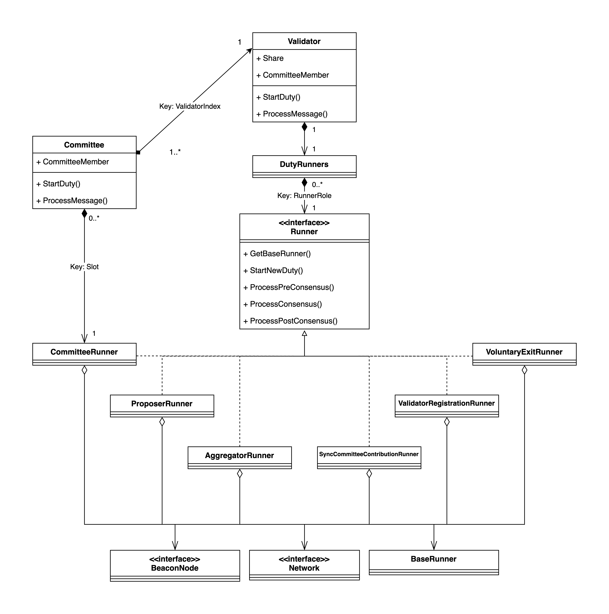

# Code Documentation

## Network

`Network` is an interface that allows the broadcasting of a message to the P2P network through its `Broadcast` method.

## BeaconNode

`BeaconNode` is an interface that allows the node to fetch duty data (e.g. an Attestation vote and a block to be proposed) and to submit a signed data (e.g. a signed Attestation vote and a signed block).

It also provides a method to get the blockchain domain (a sequence of bytes used in signatures that identifies the blockchain) and it holds a `BeaconNetwork` that provides information about the blockchain such as the current slot and fork version.

## Runner

`Runner` is an interface that provides methods to execute a duty following the SSV protocol. It has 6 implementations:
- `CommitteeRunner`
- `ProposerRunner`
- `AggregatorRunner`
- `SyncCommitteeContributionRunner`
- `ValidatorRegistrationRunner`
- `VoluntaryExitRunner`

Each implementation of `Runner` performs its associated duty type, as suggested by their names. A notable difference is that a `CommitteeRunner` object will only execute one `CommitteeDuty` throughout its life. Other `CommitteeRunner` objects will be created to execute upcoming `CommitteeDuties`. For the other runners, they will execute all duties of their associated types during its life.

The `Runner` holds a `BaseRunner` object that performs a common set of behaviours between all runners, similar to a parent class. Also, it holds a `Network` object for network communication and a `BeaconNode` to fetch data for its duties.

The interface includes a method to start a new duty and three methods to process a message according to the associated protocol step (Pre-Consensus, Consensus, and Post-Consensus).

## DutyRunners

`DutyRunners` is simply a map that links a `RunnerRole` (similar to a duty type) to an implementation of `Runner`. It's used by the [`Validator`](#validator) for non-committee duties.

## Validator

The `Validator` structure represents a single validator. It holds:
- a `DutyRunners` object to execute its non-committee duties.
- a `Share` that contains information about the validator, as its `ValidatorIndex` and public key, as well as information about the public share keys associated to each operator that belongs to its committee.
- A `CommitteeMember` object that contains information about its associated committee, including its operators and network public keys.

The `Validator` provides methods to start a new duty, for any duty type except Attestation and Sync Committee, and to process a message. Attestation and Sync Committee duties are not treated by the validator since they belong to the `CommitteeDuty` type which is treated by the [`Committee`](#committee) structure.

## Committee

The main entry point of the SSV module is the `Committee` structure. It represents a committee to which the operator belongs.

The Committee holds a set of [`Validators`](#validator) as well as a `CommitteeMember` object that contains information about the committee, such as the operators that belong to it and their network public keys.

The Committee also holds [`CommitteeRunners`](#runner) that perform a `CommitteeDuty` for a given slot. Notice that these duties may run in parallel.

